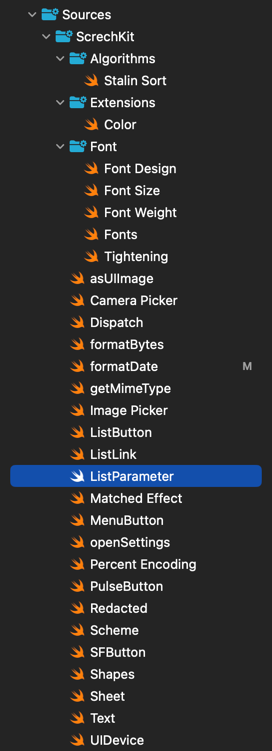

# ScrechKit

ScrechKit is a library designed to make SwiftUI even swifter. 
It makes the use of many modifiers easier and your code more readable

## Stalin Sort
Stalin Sort is a humorous and ~~in~~efficient sorting algorithm inspired by the historical figure [Joseph Stalin](https://en.wikipedia.org/wiki/Joseph_Stalin).
It works by iterating through a list of elements and ~~putting in the gulag~~ removing any element that is not in order, resulting in a sorted list of the remaining elements

```swift
let array = [1, 4, 2, 3, 5]
let sortedByStalin = stalinSort(array)

print(sortedByStalin)
// [1, 4, 5]
```

## Color Extensions




.applyPercentEncoding

.redacted

main and delay


getMimeType
